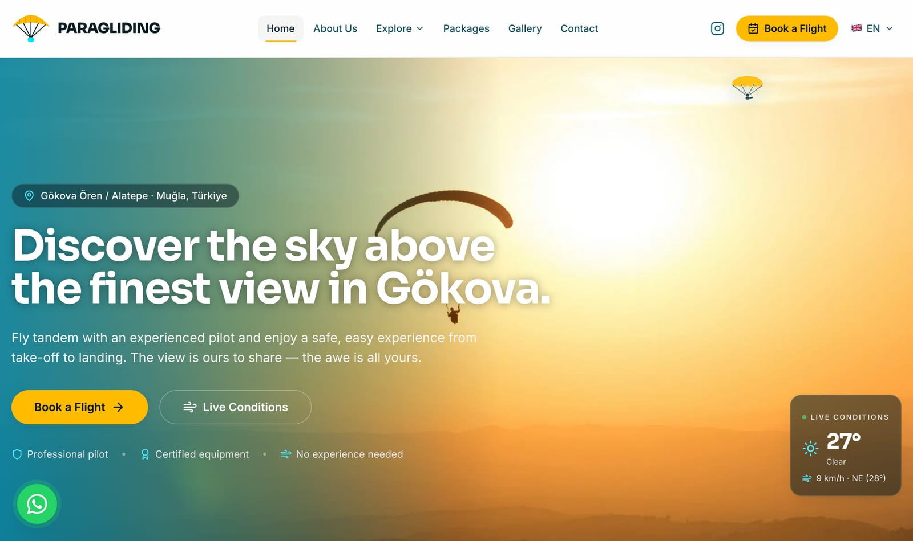
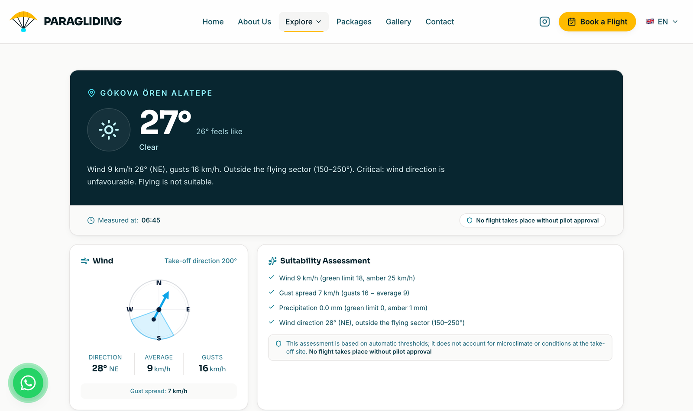
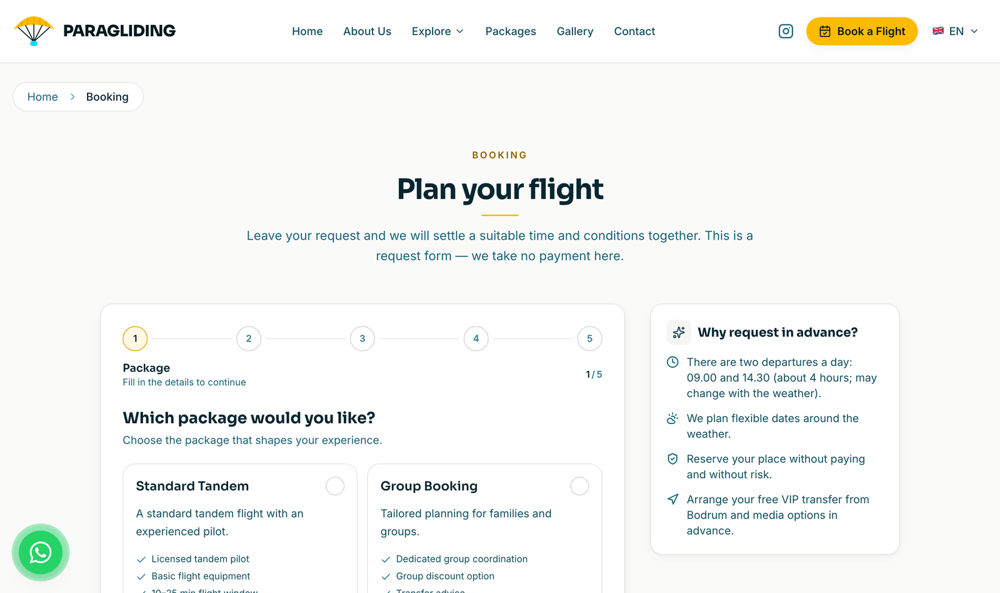
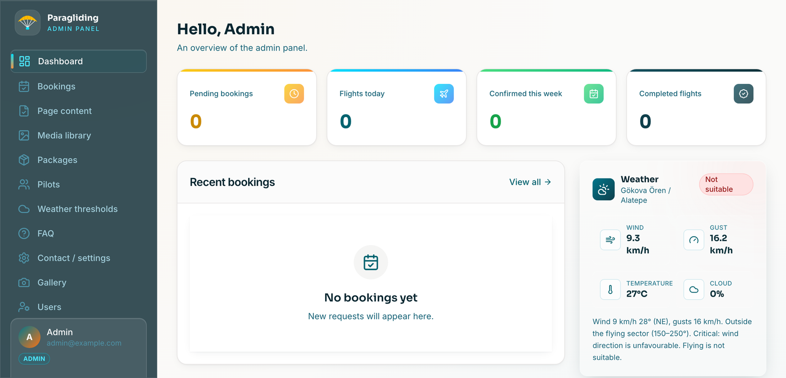
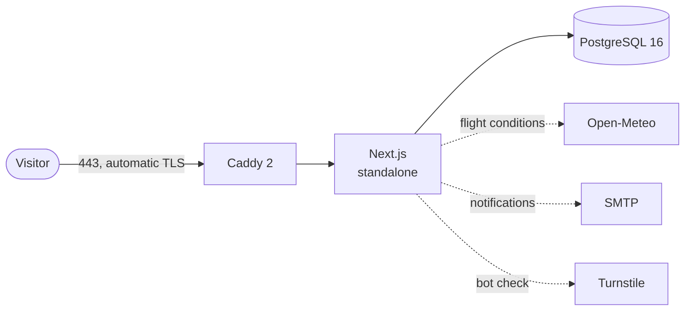
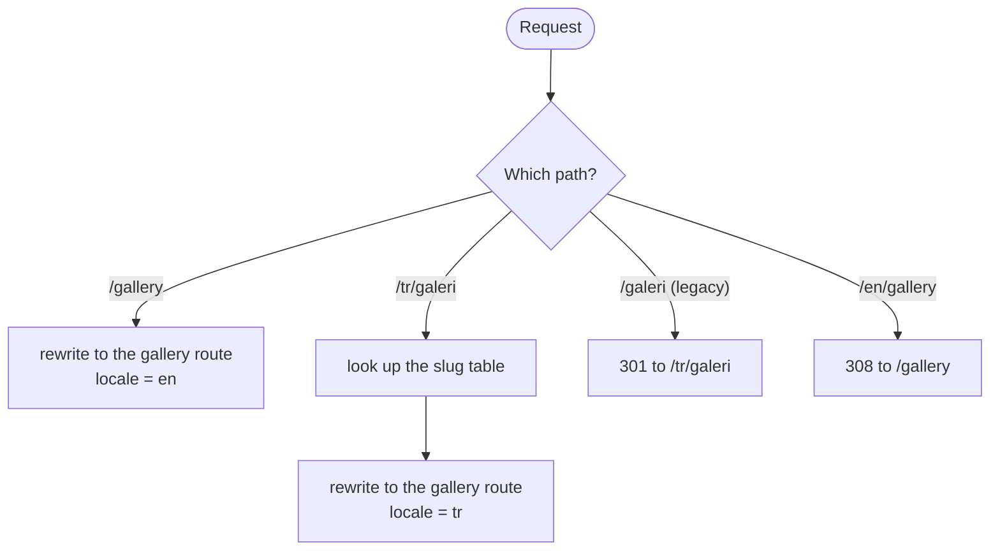
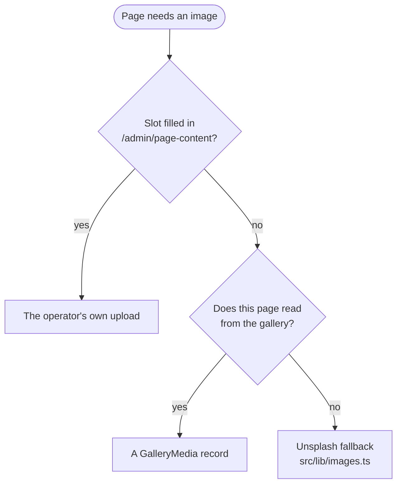

<div align="center">

# Paragliding

**Booking and operations site for a tandem paragliding business.**

A multilingual public site, a live flight-conditions panel fed by real weather
data, and an admin panel that owns every word and image on the front end.

[](https://nextjs.org)
[](https://www.typescriptlang.org)
[](https://www.prisma.io)
[](https://www.postgresql.org)
[](https://tailwindcss.com)
[](https://docs.docker.com/compose/)

</div>

---

## Screenshots

|  |  |
|:--|:--|
|  |  |
| **Home** — stock imagery stands in until the operator uploads their own. | **Live conditions** — Open-Meteo readings graded against flight thresholds. |
|  |  |
| **Booking** — a five-step request form; no payment is taken. | **Admin panel** — bookings, content, media, packages, pilots, thresholds. |

---

## Contents

- [What it does](#what-it-does)
- [Tech stack](#tech-stack)
- [Quick start](#quick-start)
- [Running the full stack](#running-the-full-stack)
- [How it fits together](#how-it-fits-together)
- [Project layout](#project-layout)
- [Commands](#commands)
- [Configuration](#configuration)
- [Database](#database)
- [Before you go live](#before-you-go-live)

---

## What it does

### 🌍 Multilingual, without an i18n dependency

The default locale is served unprefixed (`/gallery`); every other locale gets
its own prefix **and translated slugs** (`/tr/galeri`). `hreflang` and canonical
tags are emitted for each. Adding a locale means adding a dictionary and a slug
map — no route folder changes.

### 🪂 Booking

Two departures a day. A slot closes 30 minutes before take-off, and a request
that arrives too late rolls over to the next slot, or to the next day if none is
left. No payment is taken: this is a request form, and the operator confirms.

### 🌤️ Live conditions

Open-Meteo data graded green / amber / red against per-site thresholds — wind
speed, gust spread, precipitation, visibility and the acceptable wind-direction
sector. Thunderstorms force red.

> The panel is informational. The final call belongs to the pilot at the launch
> site, and the UI says so on every surface that shows it.

### 🛠️ Admin panel

Bookings with a status history, packages, pilots, FAQ, users and weather
thresholds. Every public page's copy and imagery is editable, per locale, from
`/admin/page-content`.

### 🖼️ Media library

Bulk upload with automatic optimization (`sharp`), video support with H.264
transcoding (`ffmpeg`), and dimension capture so the masonry gallery can lay
out without cropping.

---

## Tech stack

| Layer | Technology |
|:--|:--|
| Framework | Next.js 16 (App Router, `output: standalone`) |
| Language | TypeScript 5, `strict` |
| Styling | Tailwind CSS 3 |
| ORM | Prisma 5 |
| Database | PostgreSQL 16 |
| Authentication | NextAuth 4 — credentials, role-based |
| Validation | Zod 3, shared between client and server |
| Weather | Open-Meteo (no API key) |
| Media | sharp, ffmpeg |
| Bot protection | Cloudflare Turnstile (optional) |
| Containers | Docker Compose — web + postgres + caddy |
| Reverse proxy | Caddy 2, automatic TLS |

**Requirements:** Node.js ≥ 20, npm ≥ 10, and Docker ≥ 24 with Compose v2 for
the full stack.

---

## Quick start

```bash
# 1) Dependencies
npm install

# 2) Environment — fill in NEXTAUTH_SECRET and DATABASE_URL at minimum
cp .env.example .env

# 3) Prisma client
npm run db:generate

# 4) Database (or point .env at a PostgreSQL you already run)
docker compose up -d db

# 5) Schema
npm run db:migrate

# 6) Seed. Without the flag this only creates the admin account and leaves
#    real content untouched — that is the production-safe form.
SEED_SAMPLE_DATA=true npm run db:seed

# 7) Dev server → http://localhost:3000
npm run dev
```

> `ADMIN_PASSWORD` must be set and at least 8 characters. Known placeholders
> (`admin123`, `replace-me`, …) are rejected — generate one with
> `openssl rand -base64 18`.

---

## Running the full stack

```bash
cp .env.example .env
docker compose up -d --build
docker compose exec web npm run db:deploy
docker compose exec web npm run db:seed
```



| Service | What it is |
|:--|:--|
| `db` | PostgreSQL 16 — `localhost:5432` |
| `web` | Next.js standalone server — `localhost:3000` |
| `caddy` | Reverse proxy with automatic TLS — `:80`, `:443` |

Point `SITE_DOMAIN` at your real domain and Caddy will obtain a Let's Encrypt
certificate for it.

> [!IMPORTANT]
> `NEXT_PUBLIC_*` values are inlined into the client bundle **at build time**,
> so the image must be rebuilt (`--build`) after changing them — restarting the
> container is not enough. Compose passes them through `build.args`.

---

## How it fits together

### Locale routing

Route folders are named with the English slugs, and English is the default
locale, so English URLs are served unprefixed. Anything else arrives as
`/<locale>/<translated-slug>` and is rewritten onto the English folder by
`src/middleware.ts`.



Each locale keeps its slug table next to its copy in `src/messages/`, which
leaves `src/lib/i18n` free of localized strings. Turkish pages were once served
without a prefix, so those legacy addresses redirect permanently rather than
silently rendering English.

### Where an image comes from

Three layers; the first one that is set wins.



The repository ships **no image files at all** — `public/` holds only the empty
upload directories, so a fresh checkout needs no extra copy step. The fallback
module stores nothing either; it only builds URLs.

The brand mark is drawn in code, in `src/components/site/BrandMark.tsx`: a
paraglider glyph in the two theme colours plus a wordmark that renders
`NEXT_PUBLIC_SITE_SHORT_NAME` as real text. It inks itself with `currentColor`,
so one component covers light and dark grounds without a second asset. The
favicons are the same glyph.

> [!WARNING]
> The fallback set is stock photography. It does not show the operator's actual
> launch site, equipment or pilots, and must never be presented as evidence of a
> pilot licence, a safety procedure or flight conditions. Replace it from the
> admin panel before launch — and note that the brand mark is a neutral
> placeholder drawn for this repository, not anyone's real brand.

### SEO

`src/app/sitemap.ts` emits the static routes plus the package list from the
database, with `alternates.languages` per entry. `src/lib/seo/structured-data.ts`
builds the JSON-LD — LocalBusiness, Organization, TouristAttraction, Service,
FAQPage and BreadcrumbList — embedded through `src/components/site/JsonLd.tsx`.

---

## Project layout

```
.
├── prisma/
│   ├── schema.prisma                    # Models, all named in English
│   ├── migrations/0000_init/            # Single English baseline
│   ├── rename-legacy-identifiers.sql    # Upgrade path for older databases
│   └── seed.ts
├── public/uploads/                      # Panel uploads (not in the repo)
├── docs/screenshots/
├── scripts/                             # Outbox drain, media import, migrations
├── src/
│   ├── app/
│   │   ├── [locale]/                    # Localized public pages
│   │   ├── admin/                       # Admin panel
│   │   ├── api/                         # Route handlers
│   │   └── login/
│   ├── components/                      # site, admin, weather, gallery, booking, ui, motion
│   ├── lib/                             # site, images, auth, i18n, weather, seo, gallery, media
│   ├── messages/                        # en.ts · tr.ts — copy, slugs and error tables
│   └── middleware.ts                    # Locale routing + access control
├── Caddyfile
├── Dockerfile
├── docker-compose.yml
└── tailwind.config.ts                   # Single source for every visual token
```

---

## Commands

| Command | What it does |
|:--|:--|
| `npm run dev` | Development server |
| `npm run build` | Production build |
| `npm run start` | Production server |
| `npm run lint` | ESLint |
| `npm run typecheck` | `tsc --noEmit` |
| `npm run db:generate` | Generate the Prisma client |
| `npm run db:migrate` | Create and apply a development migration |
| `npm run db:deploy` | Apply migrations (production) |
| `npm run db:push` | Push the schema without a migration (throwaway databases) |
| `npm run db:seed` | Seed — admin account only, unless `SEED_SAMPLE_DATA=true` |
| `npm run db:seed:tandem-packages` | Seed just the tandem packages |
| `npm run db:seed:faq` | Seed just the FAQ entries |
| `npm run db:seed:weather-threshold` | Seed just the launch-site threshold |
| `npm run db:studio` | Prisma Studio — `http://localhost:5555` |
| `npm run mail:outbox` | Drain the queued mail outbox |
| `npm run db:backfill-gallery-sizes` | Fill in missing gallery image dimensions |
| `npm run db:import-media` | Move legacy page media into the media library |
| `npm run db:migrate-legacy-values` | One-off data migration ([see below](#database)) |

---

## Configuration

**Business identity comes from the environment.** Brand name, domain, phone,
e-mail, social accounts and booking contacts are not stored in the repo — they
come from `NEXT_PUBLIC_*` variables (`.env.example` lists them all with
descriptions). Anything left undefined falls back to the neutral defaults in
`src/lib/site.ts`, and the matching UI sections are hidden rather than rendered
empty.

| Topic | Notes |
|:--|:--|
| **Booking contacts** | `NEXT_PUBLIC_CONTACTS`, a JSON array. Names and phone numbers are personal data and are deliberately kept out of the code. |
| **Roles** | The NextAuth credentials provider supports `admin` and `operator`; the role is written into the JWT. |
| **Secrets** | Never commit `.env`. Generate `NEXTAUTH_SECRET` with `openssl rand -base64 32`. Placeholder values are rejected in production. |
| **Colours** | Deep sea `#0B3039` (`navy`), cyan `#00E1FC` (`sky`) and yellow `#FFBB00` (`brand`). Every visual token lives in `tailwind.config.ts` and nowhere else. |

---

## Database

Models, fields, enum values, tables and columns are **all named in English**.
`prisma/migrations` holds a single English baseline; `@@map` is used only to
keep table names in snake_case, and no name in the schema hides a different
identifier in the database.

**Editable content is stored twice.** Packages, pilots, FAQ entries and gallery
media keep a required base column in the default locale (`name`, `question`, …)
and an optional translation (`nameTr`, `questionTr`, …). A locale with no
translation falls back to the base column rather than rendering blank, so a row
can be added before it is translated.

<details>
<summary><strong>Upgrading a database created before the English rename</strong></summary>

Its tables and columns still carry the original Turkish names. Take a backup and
stop the application first — code built against the old names breaks the moment
they change.

```bash
psql "$DATABASE_URL" -v ON_ERROR_STOP=1 -f prisma/rename-legacy-identifiers.sql
npx prisma migrate resolve --applied 0000_init   # record the baseline
npm run db:migrate-legacy-values                 # stored values
mv public/uploads/medya public/uploads/media     # on the uploads volume
```

The SQL file runs in one transaction. Besides renaming tables, columns and enum
types, it swaps the two copies of the editable content: the `<field>En` columns
held English while the base column held Turkish, and English is now the default
locale. Rows without a translation keep their existing text in the base column,
so nothing is lost.

`db:migrate-legacy-values` rewrites the stored values the application matches on
— page-content slugs, image slot keys, gallery categories, media preferences —
and is safe to re-run.

A database created from the baseline needs none of this.

</details>

---

## Before you go live

- [ ] Real contact details, launch coordinates and operating thresholds
- [ ] Pilot licences and package / pricing information
- [ ] Privacy, cookie and distance-selling texts reviewed by your own counsel — the ones in the repo are drafts
- [ ] Production secrets, SMTP credentials and Turnstile keys
- [ ] The operator's own photographs in place of the fallback imagery
- [ ] The operator's own brand mark in place of the placeholder
